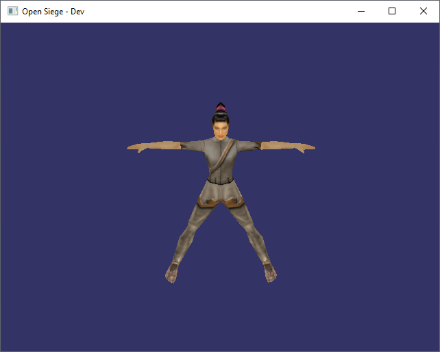
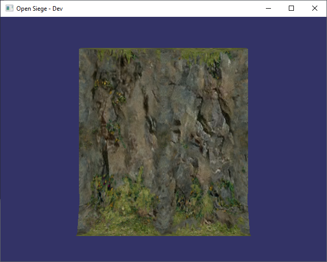
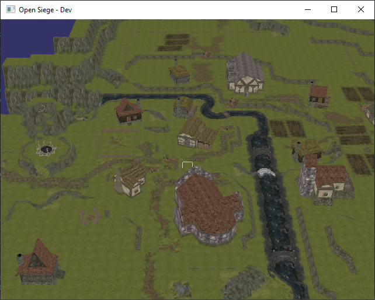

# NOTE: This repo is slowly being converted from OpenSiege and the below might be out of date

# Open Siege

Open Siege is an open source replacement for the Dungeon Siege engine originally created by Gas Powered Games.

## Getting Started

These instructions will get you a copy of the project up and running on your local machine for development and testing purposes. See deployment notes on how to deploy the project on a live system.

### Prerequisites

```
1. Dungeon Siege (Steam or Original Discs)
2. Dungeon Siege: LOA (Steam or Original Discs)
```

### Building

vsgSiege requires the installation of the [Vulkan SDK](https://vulkan.lunarg.com/sdk/home) and [VulkanSceneGraph](https://github.com/vsg-dev/VulkanSceneGraph). Please build vsgSiege out-of-source.

#### For Linux
```
sudo apt-get install -y libxdg-basedir-dev libminini-dev
```

```
git clone https://github.com/vsgSiege/vsgSiege.git
cd vsgSiege
mkdir build
cd build
cmake ..
```

##### Complete list of Command Line paramaters
```
--bits <path>
--fullscreen <0/1>
--width <int>
--height <int>
--profile <0/1>
--debuglayer <0/1>
--apidumplayer <0/1>
```

#### Expected Test State Output





## Built With

* [VulkanSceneGraph](https://github.com/vsg-dev/VulkanSceneGraph)
* [spdlog](https://github.com/gabime/spdlog.git)
* [minIni](https://www.compuphase.com/minini.htm)
* [whereami](https://github.com/gpakosz/whereami)
* [ValveFileVDF](https://github.com/TinyTinni/ValveFileVDF)
* [re2c](https://re2c.org/)
* [bison](https://www.gnu.org/software/bison/)

## Authors

Open Siege Team

## License

This project is licensed under the GPLv3 License - see the [LICENSE](LICENSE) file for details

## Acknowledgments

* Gas Powered Games for creating such a fantastic engine and game
* The Dungeon Siege community